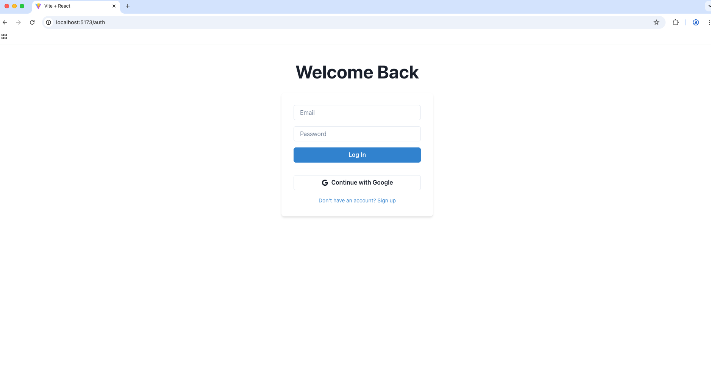
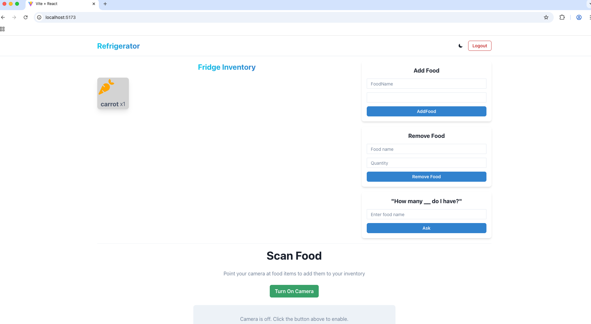
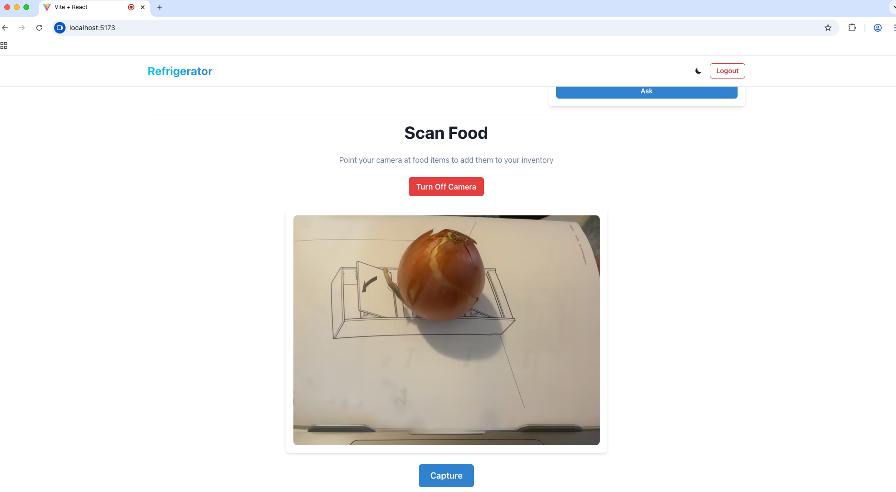
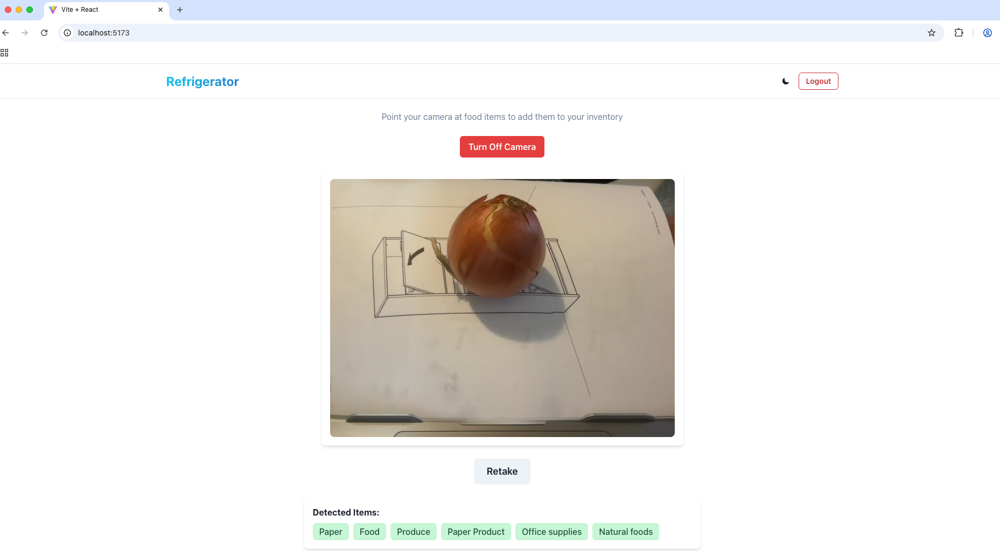
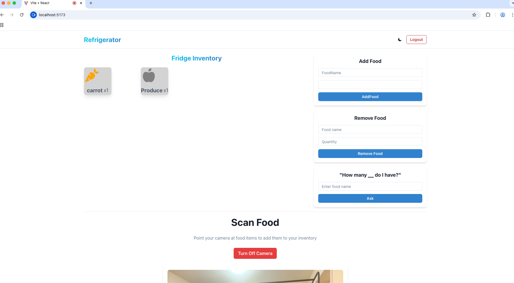

# Food Radar - Smart Refrigerator Inventory

A web application that helps you track your refrigerator inventory using manual entry or AI-powered image recognition via Google Cloud Vision API.

## Disclaimer

> **Note:** This is a proof-of-concept project with known limitations:
>
> - **No filtering on image recognition** - Google Vision API returns all detected labels (not just food items), so you may see non-food items added to your inventory
> - **Camera placement** - Designed for a camera mounted inside a refrigerator, but currently uses webcam as a stand-in for demo purposes
> - **Recognition accuracy** - Image recognition quality depends on lighting, image clarity, and Google Vision API's label detection capabilities

## Features

- **User Authentication** - Local signup/login with JWT + Google OAuth
- **Inventory Management** - View all food items in your fridge
- **Add/Remove Food** - Manually manage your inventory
- **AI Food Scanning** - Use your webcam to scan and detect food items automatically
- **Ask Feature** - Quick lookup to check if you have a specific item

## Tech Stack

### Backend
- Node.js + Express.js
- MongoDB + Mongoose
- JWT Authentication
- Google Cloud Vision API
- bcrypt for password hashing

### Frontend
- React 18 + Vite
- Chakra UI
- Zustand (state management)
- Axios
- React Router
- react-webcam

## Prerequisites

- Node.js 18+
- MongoDB Atlas account (or local MongoDB)
- Google Cloud account with Vision API enabled
- Google OAuth credentials (for social login)

## Installation

### 1. Clone the repository

```bash
git clone https://github.com/charrmint/FoodRadar.git
cd FoodRadar
```

### 2. Install dependencies

```bash
npm install
```

Or install separately:

```bash
cd backend && npm install
cd ../frontend && npm install
```

### 3. Environment Variables

**Backend** (\`backend/.env\`):

```
PORT=5050
MONGO_URI=mongodb+srv://<username>:<password>@cluster.mongodb.net/foodradar
JWT_TOKEN=your_jwt_secret_key_here
GOOGLE_CLIENT_ID=your_google_oauth_client_id
GOOGLE_CLIENT_SECRET=your_google_oauth_client_secret
GOOGLE_CALLBACK_URL=http://localhost:5050/api/auth/google/callback
GOOGLE_CLOUD_API_KEY=your_google_cloud_vision_api_key
```

### 4. Google Cloud Setup

1. Go to [Google Cloud Console](https://console.cloud.google.com/)
2. Create a new project or select existing
3. Enable **Cloud Vision API**
4. Go to **APIs & Services** → **Credentials**
5. Create an API key for Vision API
6. Create OAuth 2.0 credentials for Google Sign-In
   - Authorized redirect URI: \`http://localhost:5050/api/auth/google/callback\`

## Running the Application

```bash
# Terminal 1 - Backend
cd backend
npm run dev

# Terminal 2 - Frontend
cd frontend
npm run dev
```

- Backend: \`http://localhost:5050\`
- Frontend: \`http://localhost:5173\`

## Project Structure

```
Food_Recognition-BCSHacks-2025/
├── backend/
│   ├── middleware/
│   │   └── authMiddleware.js
│   ├── models/
│   │   ├── User.js
│   │   └── Refrigerator.js
│   ├── routes/
│   │   ├── authRoutes.js
│   │   ├── refrigeratorRoutes.js
│   │   └── scanRoutes.js
│   ├── utils/
│   │   ├── generateToken.js
│   │   └── createRefrigeratorForUser.js
│   └── server.js
│
├── frontend/
│   ├── src/
│   │   ├── api/
│   │   ├── components/
│   │   ├── features/feature-sets/
│   │   │   ├── Auth/
│   │   │   ├── Dashboard/
│   │   │   ├── Inventory/
│   │   │   ├── AddFood/
│   │   │   ├── RemoveFood/
│   │   │   ├── ScanFood/
│   │   │   └── AskFood/
│   │   ├── store/
│   │   ├── App.jsx
│   │   └── main.jsx
│   └── vite.config.js
│
└── package.json
```

## API Endpoints

### Authentication
| Method | Endpoint | Description |
|--------|----------|-------------|
| POST | \`/api/auth/signup\` | Register new user |
| POST | \`/api/auth/login\` | Login with email/password |
| GET | \`/api/auth/google\` | Initiate Google OAuth |
| GET | \`/api/auth/google/callback\` | OAuth callback |
| GET | \`/api/auth/me\` | Get current user |

### Refrigerator
| Method | Endpoint | Description |
|--------|----------|-------------|
| POST | \`/api/refrigerator\` | Create refrigerator |
| GET | \`/api/refrigerator/:id\` | Get refrigerator |
| GET | \`/api/refrigerator/:id/foodMap\` | Get food inventory |
| POST | \`/api/refrigerator/:id/addFood\` | Add food item |
| DELETE | \`/api/refrigerator/:id/removeFoods\` | Remove food item |
| POST | \`/api/refrigerator/:id/updateFoodMap\` | Bulk update (from scan) |

### Scan
| Method | Endpoint | Description |
|--------|----------|-------------|
| POST | \`/api/scan\` | Process image with Vision API |

## Screenshots

### Login Page


### Dashboard


### Food Scanning (Pre-Scan)


### Food Scanning (Post-Scan)


### Inventory View


---